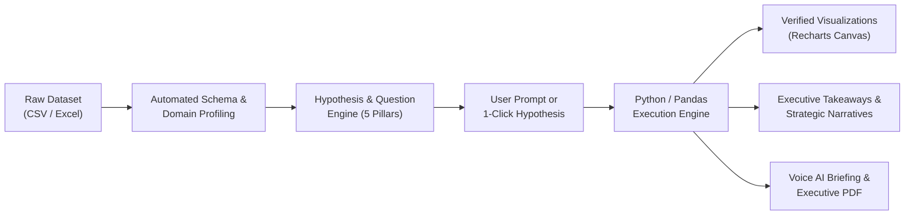

# DataLens AI 🔍⚡
> **GOMYCODE Hackathon: “Come Build with AI” (27 September 2026)**  
> *“Turn any dataset into verified decisions through conversation.”*  
> *“Upload your data. Ask anything. Understand everything.”*

---

## 🌟 Executive Overview

**DataLens AI** is an autonomous, domain-agnostic **AI Data Analysis Workspace & Decision Intelligence Copilot**. It bridges the gap between raw data and executive decision-making for non-technical users. 

Unlike conventional chatbots that hallucinate numbers and guess aggregates, DataLens AI executes a **deterministic two-stage pipeline**: natural language understanding generates an exact analysis plan, which is calculated directly within a **Python / Pandas execution kernel** to guarantee **100% verified ground truth numbers**.



---

## 🚀 Key Innovations & Flagship Capabilities

### 1. 🤖 Domain-Adaptive Analysis Workspace
* **Automated Hypothesis Generator**: Eliminates the "blank screen problem" by profiling any dataset and proposing 10+ categorized questions across 5 investigative pillars:
  * 🏆 **Performance & Volume Breakdowns**
  * 📈 **Trends & Timeline Velocity**
  * ⚠️ **Anomalies & 3x IQR Outliers**
  * 🔗 **Drivers & Pearson Correlations**
  * 📦 **Distribution & Composition Spread**
* **Universal Domain Intelligence**: Automatically adapts metrics and terminology to:
  * 🏥 **Healthcare & Clinical Diagnostics** (`systolic_bp`, `risk_score`, `department`)
  * 🛒 **Retail & Commercial Commerce** (`revenue`, `units_sold`, `region`)
  * 🎓 **Academic & Student Performance** (`midterm_score`, `study_hours`, `faculty`)
  * 💼 **SaaS Retention & Product Telemetry** (`monthly_revenue`, `churn_status`, `plan_tier`)
  * 📊 **Any Arbitrary CSV / Excel File** dropped by the user.

### 2. 🎙️ Voice AI "Executive Audio Briefing"
* Boardroom-ready spoken intelligence powered by browser-native Web Speech synthesis.
* Live equalizer waveform animation and 30-second spoken executive overview with key quantitative metrics, leading cohort shares, and risk alerts.
* Zero external API cost, ultra-low latency, and 100% offline-compatible.

### 3. 🔮 Prescriptive "What-If" Scenario Simulator
* Takes analytics from *descriptive* ("What happened?") to *prescriptive* ("What should we do?").
* Interactive sliders ($-50\%$ to $+100\%$) and cohort presets.
* Re-computes projected volume shifts, baseline vs. projected deltas, and dual Recharts bar charts in real time.

### 4. ⚖️ Cohort & Segment Comparator
* Direct head-to-head benchmarking between any two segments (e.g. *North vs. South*, *Cardiology vs. Neurology*, *Enterprise vs. Starter*).
* Generates a side-by-side Metric Scorecard with percentage variance, volume shares, and advantage leader badges.

### 5. 🧹 1-Click AI Data Sanitation & Export
* Automated statistical cleaning using **3x IQR Winsorization** (clipping outliers without dropping valid rows).
* Intelligent missing value imputation (median for numericals, standardized tags for categoricals).
* Download sanitized CSV ready for data science pipelines.

### 6. 📄 Boardroom-Ready Executive PDF Report
* Compiles an executive summary, high-level metrics, and bulleted takeaways into an exportable, printable PDF.

---

## 📐 3-Page Dedicated Application Architecture

```
┌────────────────────────────────────────────────────────────────────────┐
│                          DATALENS AI STUDIO                            │
├─────────────────────┬───────────────────┬──────────────────────────────┤
│ 1. AI Workspace     │ 2. Dashboard      │ 3. Insights Engine           │
│ - Natural Language  │ - 4 KPI Cards     │ - Autonomous Proactive       │
│ - 5 Pillar Hypotheses│ - Revenlo Charts  │   Statistical Discoveries    │
│ - Python GroundTruth│ - Donut Breakdown │ - Severe Outlier Alerts      │
│ - Code Transparency │ - Records Table   │ - Pearson Drivers (|r|>=0.45)│
└─────────────────────┴───────────────────┴──────────────────────────────┘
```

---

## ⚡ Quick Start (Local Launch with Zero Port Conflicts)

DataLens AI includes **Automatic Port Collision Resolution** so it never crashes with `[WinError 10048] Address already in use`.

### Method A: One-Click Launch (Recommended)
Double-click [`run_app.bat`](file:///c:/Users/lenovo/Desktop/Hackathone/run_app.bat) or run:
```bash
python run.py
```
* Automatically tests if port `8000` is free. If occupied, safely switches to `8080`, `8008`, `8090`, etc.
* Automatically launches your web browser as soon as the server is ready.

### Method B: Custom Port Specification
If you have other services running and wish to bind to a specific port:
```bash
# Windows Batch
.\run_app.bat 8088

# Python Runner
python run.py --port 8088
```

### Access in Browser:
👉 **[http://127.0.0.1:8000](http://127.0.0.1:8000)** (or the auto-assigned port).

---

## 🌐 Cloud Deployment Guide (For the Hackathon Jury)

You can easily deploy DataLens AI to the cloud so the judges can access a live public URL from their phones or laptops.

### Option 1: Render (Free & Fast)
1. Push this repository to GitHub.
2. In [Render Dashboard](https://dashboard.render.com), click **New +** → **Web Service**.
3. Connect your repository.
4. Set the following configuration:
   * **Runtime**: `Python 3`
   * **Build Command**:
     ```bash
     pip install -r backend/requirements.txt && cd frontend && npm install && npm run build && cd ..
     ```
   * **Start Command**:
     ```bash
     cd backend && uvicorn main:app --host 0.0.0.0 --port $PORT
     ```
5. Click **Deploy Web Service**. Render will assign you a live HTTPS URL (e.g. `https://datalens-ai.onrender.com`).

---

### Option 2: Railway.app
1. In [Railway](https://railway.app), click **New Project** → **Deploy from GitHub repo**.
2. Railway detects Python automatically. Set Start Command:
   ```bash
   python run.py --port $PORT --no-browser
   ```
3. Generate Domain under Service Settings.

---

### Option 3: Instant Public Demo via ngrok / LocalTunnel (Zero Deploy Setup)
If you want to demo live during the hackathon without configuring cloud servers:
```bash
# 1. Start your local platform
python run.py --no-browser

# 2. In another terminal, expose port 8000 via ngrok
npx localtunnel --port 8000
# or
ngrok http 8000
```
This gives you an instant public HTTPS link (e.g. `https://datalens-ai.loca.lt`) to share with the jury!

---

## 🧪 Tech Stack & Engineering Rigor

| Layer | Technologies Used | Purpose |
| :--- | :--- | :--- |
| **Frontend** | React 18, Vite, Tailwind CSS, Recharts, Lucide Icons | Responsive modern SaaS workspace with dark/light themes |
| **Backend API** | FastAPI, Uvicorn, Pydantic, Python 3.12 | High-throughput async REST API serving static SPA bundle |
| **Data Engine** | Pandas, NumPy, Scipy | Ground-truth mathematical calculations, 3x IQR outliers, Pearson correlation |
| **Voice AI** | Native HTML5 Web Speech Synthesis API | Zero-latency executive verbal speech synthesis |
| **LLM Reasoning** | Google Gemini / Groq / Ollama (Llama 3) / OpenAI | Fallback-resilient natural language explanation synthesis |

---

## 👨‍💻 Project Presentation Checklist for Hackathon Jury
- [x] **Zero Hallucination Proof**: Click **Inspect Code** to demonstrate real Pandas kernel execution.
- [x] **Hypothesis Generation**: Show automated question cards populated immediately upon dataset upload.
- [x] **Multi-Domain Versatility**: Switch between *Retail Sales*, *Clinical Health*, and *Student Academics* in 1 click.
- [x] **Interactive Prescriptive AI**: Demonstrate the **What-If Simulator** with live slider shifts.
- [x] **Auditory Experience**: Click **Voice Brief** to present the speech briefing.
- [x] **Data Hygiene Action**: Download the sanitized CSV using the **Data Sanitizer**.
- [x] **Tangible Takeaway**: Export the **Executive PDF Report**.
